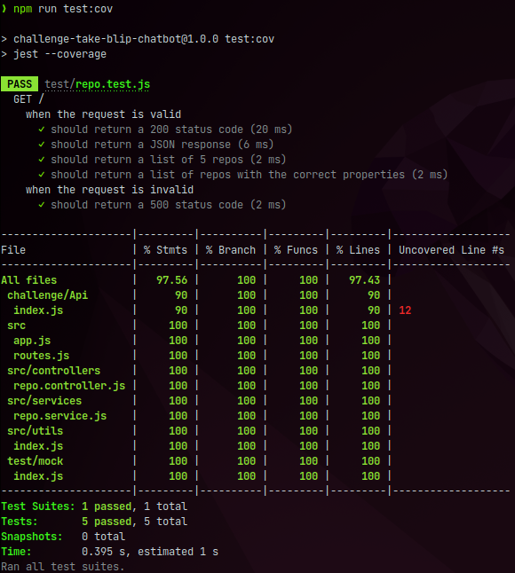

> [](https://www.linkedin.com/company/takeblip/ "Logo Take Blip, link para o linkedin da Take Blip")

# Take Blip - Desafio - Chatbot Developer

## Descrição

O desafio consiste em desenvolver um chatbot que responda segundo um fluxo conversacional, [na plataforma da Take Blip](https://portal.blip.ai/ "Link da plataforma"). Além disso, o chatbot deve consumir dados de uma API, feita em JavaScript ou C#, para realizar a resposta.

<details>
  <summary><strong>Estrutura do repositório</strong></summary><br />

```bash
├── challenge
│   ├── Api
│   │   └── index.js
│   └── Flow
│       └── mybotflow.json
├── index.js
├── LICENSE
├── package.json
├── package-lock.json
├── README.md
├── src
│   ├── app.js
│   ├── controllers
│   │   └── repo.controller.js
│   ├── images
│   │   ├── chat-bot.gif
│   │   ├── Desafio.png
│   │   ├── Take.Be.png
│   │   ├── TakeCharge.png
│   │   ├── Take.Execellence.png
│   │   ├── Take.Higher.png
│   │   ├── Take.Simple.png
│   │   ├── Take.Team.png
│   │   └── test-cov.png
│   ├── routes.js
│   ├── services
│   │   └── repo.service.js
│   └── utils
│       └── index.js
└── test
    ├── mock
    │   └── index.js
    └── repo.test.js
```
</details>

## Rodando API localmente

### Baixando o repositório

```bash
# clonando o projeto
$ git@github.com:Dogl4/challenge-take-blip-chatbot.git

# instalando dependências
$ npm install
```

### Rodando a API

```bash
# rodando o servidor
npm start

# rodando o servidor em modo de desenvolvimento
npm run dev
```
```bash
# se não inicializar, verifica se não existe nada rodando na porta 3000, comando para linux
$ lsof -i:3000

# se existir, feche o processo, comando para linux
$ kill -9 $(lsof -t -i:3000)
```
<details>
  <summary><strong>Modificando a porta</strong></summary><br />

> A porta padrão é `3000`. Você pode alterar isso renomeando o arquivo `.env.example` para `.env` e modificando o valor da variável `PORT`.
</details>

## Test

```bash
# integration test
$ npm run test

# test coverage
$ npm run test:cov
```

<details>
  <summary><strong>Imagem de cobertura de test</strong></summary><br />

 | [](./src/images/test-cov.png "Screenshot do chatbot") |
 |------------------------------------------------------------------------------------------------------------------------------------------------------------|
 | _imagem-do-comando:_  `npm run test:cov`                                                                                                                   |
</details>

## Screenshot

| [](./src/images/chat-bot.gif "Screenshot do chatbot") |
|--------------------------------------------------------------------------------------------------------------------------------------------------|
| _chat-bot-gif_

## Links

  - [API](https://dogl4-take-blip.herokuapp.com/ "Api no Heroku")
  - [Chat-bot](https://pedro-douglas-pereira-barreto-rgf3e.chat.blip.ai/?appKey=bG9yYXZhbG9yZXNkYXRha2UxOmRjOTJjMDFjLTlmNzQtNDNmYi05ZGQ3LWQ2MWE5MjUwMjE5Mw== "Link do chatbot dentro da blip")

## License

  Dogl4/challenge-take-blip-chatbot is [MIT licensed](./LICENSE)
